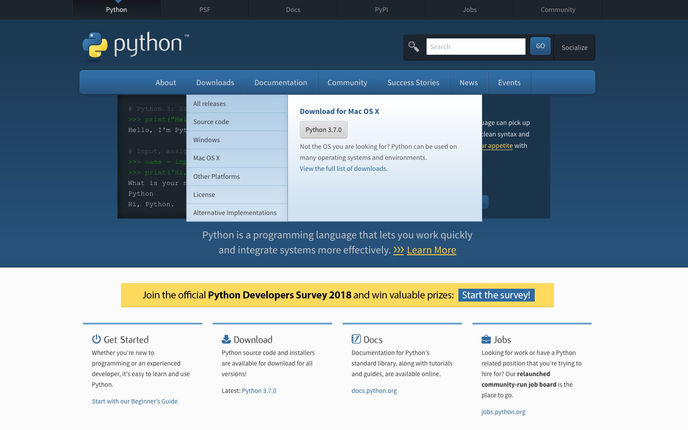
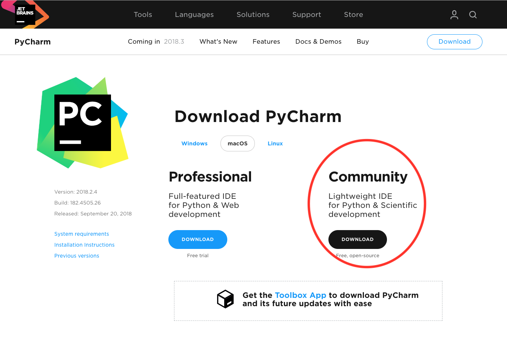

# PyClub
Just a repo where there will be lesson notes uploads and also some exercises. There might also be some announcements.

## Setup and Installation
We are going to be using a few things: an IDE, Python 3.7, and also pip.

To install Python 3.7 go to https://www.python.org/ and go to the **Download** tab of the menu bar, you should be able to find "Download of MacOSX"

 

Then click download "Python 3.7.0". This is the newest version of Python as of October 2018.
It is important that we are all running the same version of Python, because some of the code will be different on different versions.
Next we will be installing Pycharm which is an amazing IDE, it is similar to the IDE IDLE that we used during class. IDEs are great
because they are like a toolbox that include everything. To install go to this link --> https://www.jetbrains.com/pycharm/download/#section=mac




Download the community edition.

### Git Setup
All of you are added to this repository, to download all of the code examples, lessons and work that we will have for the entire
year you must *clone* the repository. Open *terminal* and type the following code exactly:
```bash
$ cd documents
$ git clone https://github.com/alansun17904/teach_python.git
```
At this point after you type the line above there should be a pop-up that says you do not have `git` and you must install it, 
just click install and it should take a while to install. After installing git you should be able to rerun the line above.

### Installing `pip`
`pip` is useful for installing packages, which are basically just code that other people published. Again to install `pip`
you must open *terminal*.
```bash
$ sudo easy_install pip
```
The terminal will require you to type in your password.

### Installing `jupyter`
Jupyter is great for looking at the lessons that we presented during class, because it is very well formatted. Jupyter is 
one of the most popular data science IDEs out there, and it is also great for making code presentations. After installing pip
you must go back into terminal and upgrade pip
```bash
$ pip3 install --upgrade pip
$ pip3 install jupyter
```
We will talk about how to activate jupyter later...